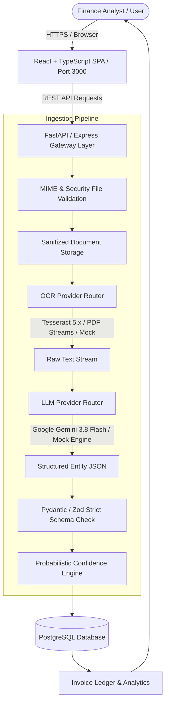

# AI Invoice Analyzer — Enterprise OCR & LLM Extraction Platform

[](https://python.org)
[](https://fastapi.tiangolo.com)
[](https://react.dev)
[](https://www.typescriptlang.org)
[](https://tailwindcss.com)
[](https://postgresql.org)
[](https://docker.com)
[](LICENSE)

An enterprise-grade document intelligence and invoice processing platform. Ingests commercial invoices in PDF, PNG, JPG, or JPEG formats, performs optical character recognition (OCR), extracts structured financial entities using Large Language Models (LLMs), calculates probabilistic confidence metrics, and empowers finance analysts with human-in-the-loop manual auditing and verification workflows.

Tailored for international and Moroccan B2B enterprise standards (Moroccan Dirham `MAD`, 15-digit `ICE` tax numbers, standard 20% TVA schedules, bilingual French/Arabic document formatting).

---

## 1. System Architecture



---

## 2. Key Features

- **Multi-Format Ingestion:** Accepts PDF, JPG, JPEG, and PNG invoice files up to 10MB with strict MIME validation.
- **Interchangeable OCR Abstraction:** High-performance Tesseract 5.x integration with deterministic mock fallback for offline demo and testing environments.
- **Structured LLM Extraction:** Guided schema extraction extracting invoice number, dates, supplier ICE, client ICE, line items (quantity, unit price, tax rate, total), and payment statuses.
- **Probabilistic Confidence Scoring:** Algorithmic 0–100% confidence score categorizing extractions into High ($\ge 90\%$), Medium ($70-89\%$), or Low ($<70\%$) with field-level completeness breakdown.
- **Human-in-the-Loop Audit & Correction:** Interactive audit modal allowing analysts to edit line items, adjust totals, correct OCR typos, and persist changes with confidence recalculation.
- **Executive KPI Dashboard:** Real-time metrics for total spend, unpaid balances, overdue exposure, monthly volume charts, and payment distribution.
- **Flexible Exporting:** Instant one-click export of structured invoice records as RFC-compliant CSV or ERP-compatible JSON.
- **Enterprise Moroccan Standards:** Native support for 15-digit ICE (`Identifiant Commun de l'Entreprise`), Moroccan Dirham (`MAD`), and standard VAT brackets (20%, 14%, 10%, 7%).

---

## 3. Tech Stack

| Layer | Technology |
|---|---|
| **Frontend** | React 18, TypeScript, Tailwind CSS, Lucide Icons, Vite |
| **Backend API** | FastAPI (Python 3.11+) / Express Gateway, Pydantic, SQLAlchemy 2.0 |
| **AI / LLM** | Google Gemini 3.8 Flash (`@google/genai` & `google-genai`), Structured JSON mode |
| **OCR** | Tesseract OCR 5.x, PyPDF2 / pdfplumber / Tesseract-FRA |
| **Database** | PostgreSQL 16 (production) with Alembic migrations |
| **Containerization** | Docker, Docker Compose, Alpine Linux, Nginx |
| **Testing** | Pytest, FastAPI TestClient, Vitest |

---

## 4. Quickstart Guide (Docker)

Run the entire full-stack system with a single command:

```bash
# 1. Clone repository
git clone https://github.com/your-org/ai-invoice-analyzer.git
cd ai-invoice-analyzer

# 2. Configure environment variables (optional for mock mode)
cp .env.example .env

# 3. Launch full stack with Docker Compose
docker compose up --build
```

The services will be available at:
- **Web Application & UI:** `http://localhost:3000`
- **FastAPI Backend & Swagger Docs:** `http://localhost:8000/docs`
- **PostgreSQL Database:** `localhost:5432`

---

## 5. Manual Installation (Development Mode)

### Backend Setup (Python / FastAPI)

```bash
cd backend
python -m venv venv
source venv/bin/activate  # On Windows: venv\Scripts\activate

pip install -r requirements.txt

# Run migrations
alembic -c ../database/alembic.ini upgrade head

# Start API server
uvicorn app.main:app --host 0.0.0.0 --port 8000 --reload
```

### Frontend Setup (React / Vite)

```bash
cd ..
npm install
npm run dev
```

Visit `http://localhost:3000` to interact with the application.

---

## 6. Pre-Packaged Demo Invoices

The project includes Moroccan sample invoices in `/sample-invoices/`:

1. **Standard Moroccan Invoice (`invoice_standard_morocco.pdf`):** ABC Technologies SARL (12,000 MAD) with ICE identifier.
2. **Multi-Item Cloud Invoice (`invoice_multi_items.pdf`):** Atlas Cloud & IT Services SA (36,000 MAD) featuring 4 complex line items.
3. **Scanned Physical Document (`invoice_scanned_ocr.pdf`):** SNAIT SA (31,200 MAD) testing OCR noise resilience and overdue terms.
4. **Missing Fields Edge Case (`invoice_missing_fields.pdf`):** Globex Logistics (6,000 MAD) triggering human-in-the-loop audit review.

---

## 7. Running Automated Tests

Run backend unit and integration test suites:

```bash
# Execute Pytest test suite
pytest backend/tests/ -v
```

Tests cover:
- Authentication, JWT issuance, duplicate checks, and user ownership isolation.
- OCR and Mock provider fallback mechanisms.
- Pydantic schema validation for complete and sparse invoices.
- Probabilistic confidence score algorithms and thresholds.
- Multipart document uploads and human-in-the-loop manual edits.
- CSV and JSON export endpoints.
- Dashboard analytics and monthly aggregation math.

---

## 8. License

Distributed under the MIT License. See [LICENSE](LICENSE) for more details.
