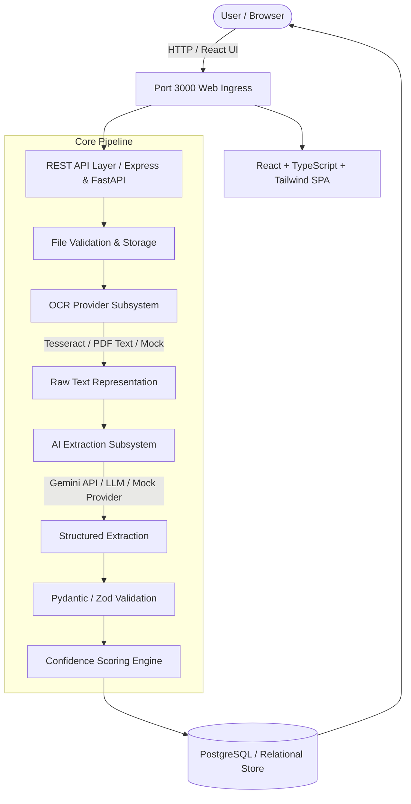

# AI Invoice Analyzer — Architecture & System Design

## 1. System Overview

**AI Invoice Analyzer** is a cloud-native, modular document processing platform designed to ingest commercial invoices (PDF, PNG, JPG, JPEG), extract optical text, perform LLM-guided structured entity extraction, validate field integrity using strict schemas, calculate probabilistic confidence scores, and support human-in-the-loop manual verification and corrections.



---

## 2. Interchangeable Abstraction Layers

### 2.1 OCR Provider Interface
The application adheres to the Dependency Inversion Principle (DIP). Text extraction is encapsulated behind the `OCRProvider` interface:

```text
OCRProvider (Abstract Interface)
├── TesseractOCRProvider (Native PDF text extraction + Tesseract OCR 5.x)
└── MockOCRProvider (Deterministic offline parsing for test & demo environments)
```

### 2.2 AI Extraction Provider Interface
Structured entity extraction transforms unstructured raw invoice text into validated Pydantic models:

```text
InvoiceExtractionProvider (Abstract Interface)
├── LLMInvoiceExtractionProvider (Gemini 3.8 Flash with structured JSON output & self-repair)
└── MockInvoiceExtractionProvider (High-fidelity heuristic Moroccan & international invoice extractor)
```

---

## 3. Data Flow & Processing Pipeline

1. **Upload & Ingestion:**
   - Accepts `.pdf`, `.png`, `.jpg`, `.jpeg` up to 10 MB.
   - Generates safe UUID-prefixed local storage names to prevent directory traversal and overwrite collisions.
   - Creates an initial `Invoice` entity with status `PROCESSING`.

2. **Optical Character Recognition:**
   - Directly parses text streams for digital PDFs (fast path).
   - Invokes OCR engine for scanned imagery or flattened PDFs.
   - Persists `raw_text` for compliance and auditing.

3. **Structured Entity Extraction:**
   - Injects raw text into a specialized prompt instructing the AI to output zero-hallucination structured JSON adhering to the schema.
   - Extracts:
     - `invoice_number`
     - `invoice_date` & `due_date`
     - `supplier` (Name, ICE / Tax ID, Address)
     - `customer` (Name, ICE / Tax ID, Address)
     - `currency` (MAD, EUR, USD, etc.)
     - `subtotal`, `tax_amount`, `total_amount`
     - `payment_status` (PAID, UNPAID, OVERDUE, UNKNOWN)
     - `items` array (Description, Quantity, Unit Price, Tax Rate, Line Total)

4. **Schema Validation & Confidence Scoring:**
   - Validates mathematical relationships ($Subtotal + Tax \approx Total$).
   - Computes a weighted 0–100% confidence metric across critical fields.
   - Flags invoices as High ($\ge 90\%$), Medium ($70-89\%$), or Low ($<70\%$).

5. **Human-in-the-Loop Verification:**
   - Financial analysts can review side-by-side with document previews.
   - Allows inline editing and line-item corrections saved directly to the database.

---

## 4. Security Architecture

- **Stateless JWT Authentication:** Access tokens signed via HMAC-SHA256 with expiration.
- **Role & Ownership Isolation:** Queries are constrained by `user_id`. Users cannot inspect or mutate invoices belonging to other accounts.
- **Safe File Handling:** Strict MIME validation, sanitized file paths, and isolated storage volume.
- **Audit Logging:** Structured operational logs with sensitive credentials, tokens, and PII masked.
